# Vicsek GNN

#### Trying to uncover pairwise potentials symbolically of birds flights using GNNs

### Real flight data projected into 2D space.

### Corrolated movement
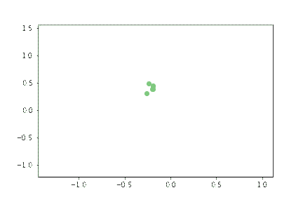
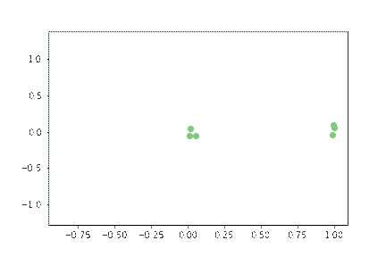

### Some birds corrolated movement
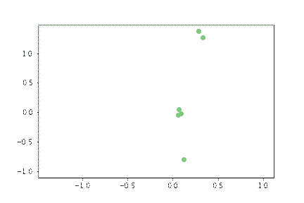

## Vicsek model for 10 birds moving at 3m/s in 3d space projected into 2D space.
## 3D Model (mathematical description)
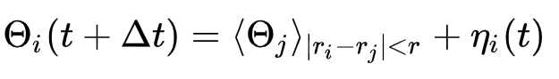
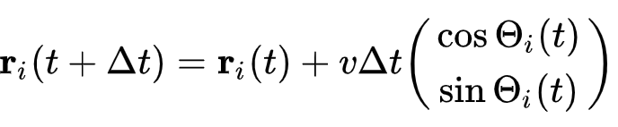

### Visulaliztion:  

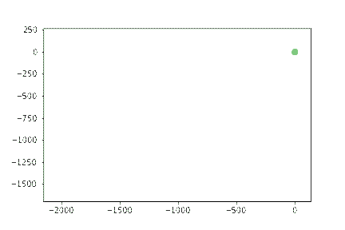
### Perameters: 
- Noise = 0.25
- Velocity = 20 (m/s)
-  Radius = 200 m 

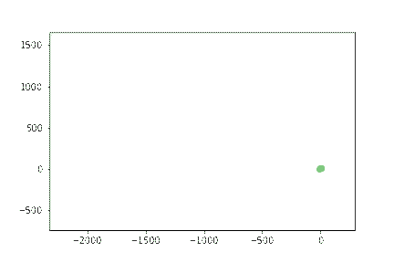
### Perameters: 
- Noise = 0.25
- Velocity = 20 (m/s)
-  Radius = 100 m 

### Limitations: 

- Birds all have same velocity

## Lenored Jones Potential to model the birds with a pairwise potential:  
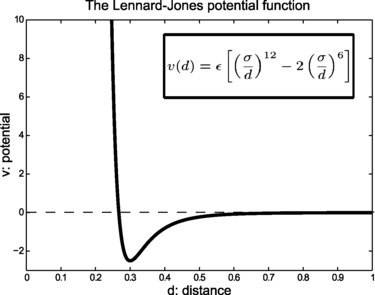

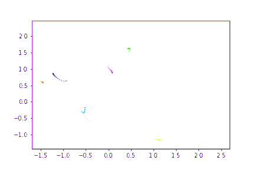

### The GNN couldnot learn from this simulation and could not reduce its loss at all! 
### Perameters: 
- epsilon 
- sigma 

# Extension:

### Using spring as a baseline: GNN works perfectly. However pairwise rules are very rigid and simple... 
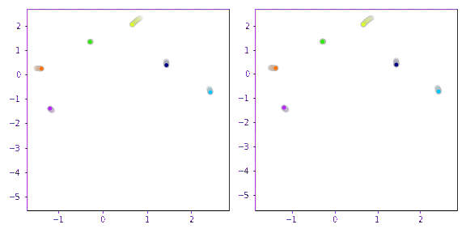

Using 95 videos of collective motion flights: 

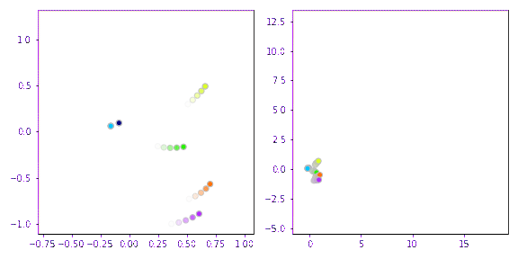

### Apply this to real flight data to try to uncover some symbolic model.

##### We assume that there is some potential between pairs of birds in the flock related to their hierarcical value difference.

# References:

- Nagy, Máté, et al. "Hierarchical group dynamics in pigeon flocks." Nature 464.7290 (2010): 890-893.

- Cranmer, Miles, et al. "Discovering symbolic models from deep learning with inductive biases." Advances in Neural Information Processing Systems 33 (2020): 17429-17442.

- https://arxiv.org/pdf/1904.09584.pdf