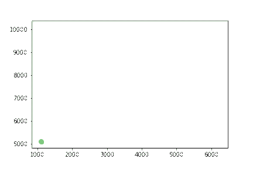
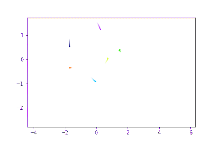

# Vicsek GNN

#### We first create a 3D simulation of 10 particles and tune perameters by eye so the simulation resembles the real bird data

## 3D Model (mathematical description)

    

    

    

# Project roadmap:

1. Build Vicsek model simulation.

### Real flight data projected into 2D space.

### Vicsek model for 10 birds moving at 3m/s in 3d space projected into 2D space.

### Lenored Jones Potential to model the birds with a pairwise potential: 

2. Visualise
3. Turn into GNN
4. Train GNN
5. Perform symbolic regression on messages to try to recover Vicsek model.

# Extension:

### Apply this to real flight data to try to uncover some symbolic model.

##### We assume that there is some potential between pairs of birds in the flock related to their hierarcical value difference.

# References:

- Nagy, Máté, et al. "Hierarchical group dynamics in pigeon flocks." Nature 464.7290 (2010): 890-893.

- Cranmer, Miles, et al. "Discovering symbolic models from deep learning with inductive biases." Advances in Neural Information Processing Systems 33 (2020): 17429-17442.

- https://arxiv.org/pdf/1904.09584.pdf